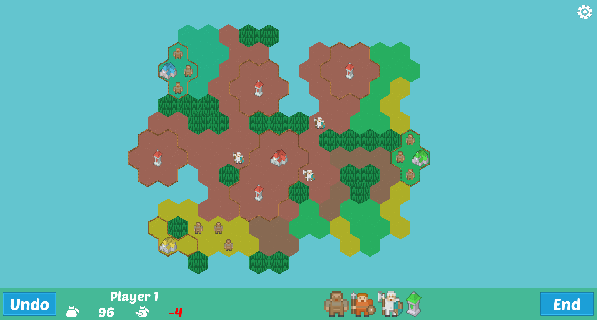
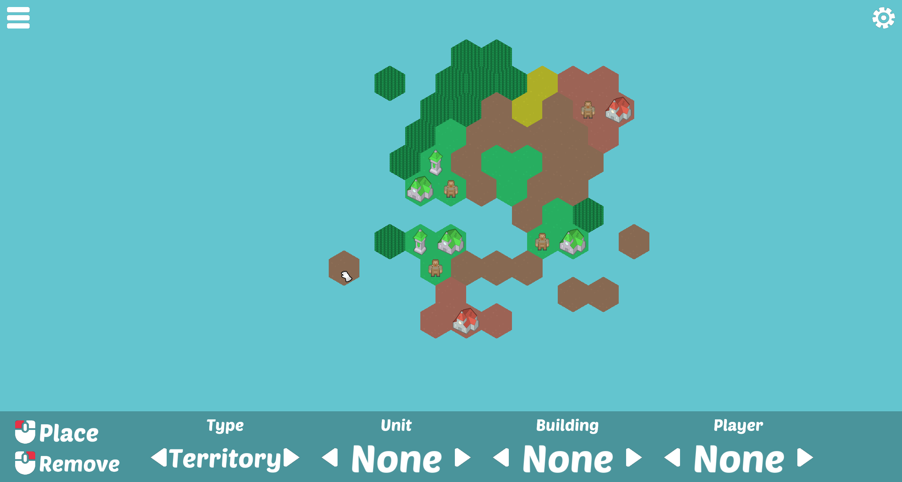

# Konkr
It is a project made in early 2025 for a C++ course. We had to make our version of the game [Konkr](https://konkr.io/). It is made in C++20 and uses SDL2. 




## How to build
```sh
mkdir -p build
cd build
cmake ..
cmake --build .
./Konkr
```
